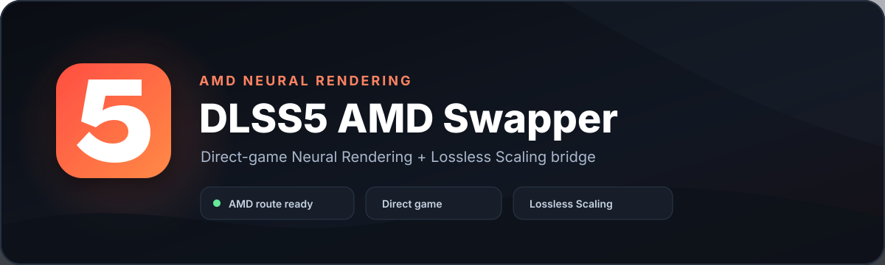
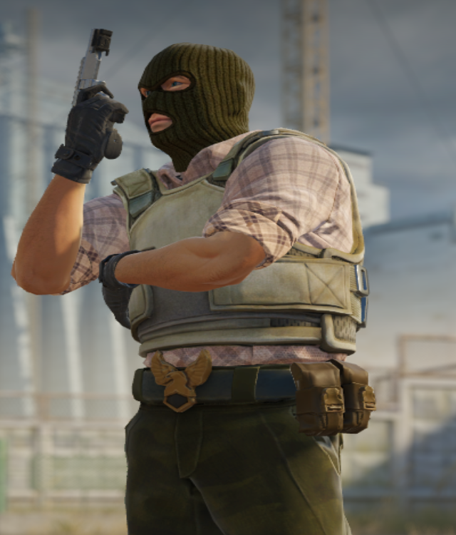
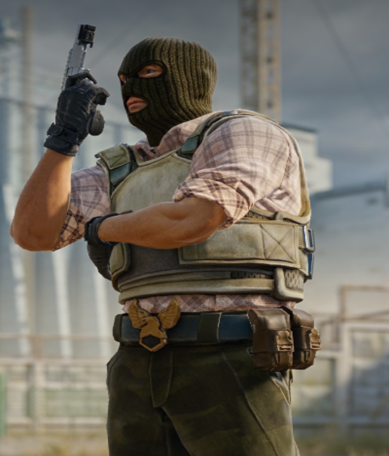

<p align="center">
  
</p>

<p align="center">
  <a href="https://github.com/eikkapine/DLSS5-AMD-Swapper/releases"></a>
  <a href="docs/install.md"></a>
  <a href="LICENSE"></a>
</p>

<p align="center"><strong>A Windows manager for running experimental DLSS Neural Rendering paths on AMD Radeon GPUs.</strong></p>

DLSS5 AMD Swapper puts the two ways I use the project into one app. **Direct Game** targets supported x64 DX12/FSR games and can feed the neural runtime real render data. **Lossless Scaling** gives me a universal desktop route that starts automatically when I press **Scale**.

> Experimental community project. Not affiliated with NVIDIA, AMD, Lossless Scaling, or the upstream compatibility projects listed below.

## Two routes, one app

| | **Direct Game** | **Lossless Scaling** |
| --- | --- | --- |
| Best for | Supported single-player/offline games | Almost any capturable game, video, browser, or app |
| Input | Game FSR colour + motion + depth when available | Finished desktop frame |
| Output | Game keeps control of final resolution | Captured source stays at native visible resolution |
| Setup | Scan → select game → **Set up** | Configure once → press **Scale** normally |
| Runtime status | Log-backed rich-input checks | Automatic bridge status |

The scanner covers **Steam, Epic, GOG, EA, Ubisoft, Battle.net, Xbox/Game Pass, Rockstar, and standalone installs**. A scan ends with a verification summary and intentionally leaves every game unselected.

## Get started

1. Open [Releases](https://github.com/eikkapine/DLSS5-AMD-Swapper/releases) and download the newest **DLSS5-AMD-Swapper** portable ZIP.
2. Extract it somewhere writable and run `Dlss5AmdSwapper.exe`.
3. For a game install, open **Game library → Scan PC**, select a compatible target, then click **Set up**.
4. For the desktop route, open **Lossless Scaling** in the app, configure your local runtime files once, then use Lossless Scaling normally.

No installer is required for the manager itself. See the full [installation guide](docs/install.md) for runtime requirements, restore behavior, and source builds.

## What the manager handles

- Universal installed-game discovery and deduplication.
- x64, DX12, FSR, and common anti-cheat compatibility checks.
- Automatic install-vs-update handling for the direct-game route.
- Official upstream installer download with size + SHA-256 verification.
- Local discovery of a legitimate `nvngx_dlssnr.dll`; it is never bundled or downloaded by this project.
- Reversible per-game setup with hash-backed manifests.
- Runtime diagnostics for colour, motion, depth, output size, and zero-copy state.
- Automatic Lossless Scaling bridge activation when **Scale** is pressed.
- Global strength and toggle hotkeys.

## Controls

| Shortcut | Action |
| --- | --- |
| `Ctrl + Alt + F6` | Toggle the effect |
| `Ctrl + Alt + F7` | Decrease strength |
| `Ctrl + Alt + F8` | Increase strength |

Lossless Scaling owns these keys while its bridge is active. The Swapper registers the same keys for a running managed direct-game target. The Lossless Scaling route supports effect strength up to `4.0`.

## Why Direct Game can look stronger

The Lossless Scaling route only receives a completed frame. Large temporal neural changes from colour alone can become unstable, so the bridge deliberately filters the residual to control flicker, smearing, and stale afterimages.

The Direct Game route sits inside the game's FSR/DX12 path. When the game exposes real colour, motion, depth, jitter, and exposure information, the neural runtime has much better guidance for structure, materials, lighting, skin, and distant detail. The implementation is described in [Neural Rendering upstream of the upscaler](docs/neural-upstream-performance.md).

## Before / after

These are the two comparison crops approved for the public repository.

| Original | Neural output |
| :---: | :---: |
|  |  |

## Requirements

### Direct Game

- Windows 11
- Supported AMD Radeon GPU
- x64 DX12 game with FSR evidence
- AMD Software: Adrenalin Edition 26.1.1 or newer for the currently tested upstream path
- Your own legitimate `nvngx_dlssnr.dll`

### Lossless Scaling

- Windows 11
- Lossless Scaling installed from an official source
- Supported AMD Radeon GPU
- User-supplied compatibility/runtime files described in [Installation](docs/install.md)

A separate ROCm install is not required for the normal direct-game route currently tested here. The compatibility runtime uses the HIP runtime supplied with the AMD driver.

## Performance evidence

I only publish concrete performance numbers when they come from hashed capture logs. The capture helper keeps game/display timing separate from bridge/runtime timing:

```powershell
.\tools\Capture-Performance.ps1 -ProcessName Game.exe -Seconds 30
```

`bridge/scripts/Analyze-Run.py` writes sanitized measurement JSON with SHA-256 references to the raw inputs. Raw logs and machine paths stay private. Before publishing I also run:

```powershell
py .\tools\Check-Publication.py
```

## Public package boundary

The repository and release package do **not** contain:

- paid Lossless Scaling files or `Lossless_original.dll`
- `DLSS-NR-on-AMD` installers/binaries or generated weights
- NVIDIA DLSS-NR DLLs, models, or weights
- third-party AMD proxy/runtime binaries
- private INIs, manifests, backups, logs, captures, or machine-specific paths
- personal files, secrets, or unreviewed screenshots

The release contains my manager plus project-built bridge/wrapper files and scripts. External runtime files remain local to the person using the tool.

## Docs

| Guide | What it covers |
| --- | --- |
| [Installation](docs/install.md) | Portable app, Direct Game, Lossless Scaling, restore, source build |
| [Direct Game](direct-game/README.md) | Compatibility, install/update flow, diagnostics, CLI |
| [Architecture](docs/architecture.md) | Manager, scanner, bridge, direct-game path, trust boundaries |
| [Performance](docs/performance.md) | Measurement policy and analyzer output |
| [Verification](docs/verification.md) | Runtime evidence and publication checks |
| [Development](docs/development.md) | Building and working on the project |
| [Licensing](docs/licensing.md) | Third-party boundary and redistribution rules |

## Credits

This project builds on public research and compatibility work from:

- [danielblnc/DLSS-NR-on-AMD](https://github.com/danielblnc/DLSS-NR-on-AMD)
- [rakanki911/DLSS5-Swapper](https://github.com/rakanki911/DLSS5-Swapper) — workflow/UI reference; this AMD manager is a separate implementation
- [LastSkywalkerER/GameSaver](https://github.com/LastSkywalkerER/GameSaver) — game-discovery architecture reference; this scanner is a separate C# implementation
- [matiasLombo/neural-upstream](https://github.com/matiasLombo/neural-upstream)
- [Kizzuwatnaa/DLSS5-Autopilot](https://github.com/Kizzuwatnaa/DLSS5-Autopilot)
- [Dagherbou/OptiScaler_DLSSNR](https://github.com/Dagherbou/OptiScaler_DLSSNR)
- [jlrouzies-fr/DLSS5-Feeder](https://github.com/jlrouzies-fr/DLSS5-Feeder)
- [FrankBarretta/LSP-ReShade](https://github.com/FrankBarretta/LSP-ReShade)

My original project code is released under the [MIT License](LICENSE). Third-party software keeps its own license and terms.
